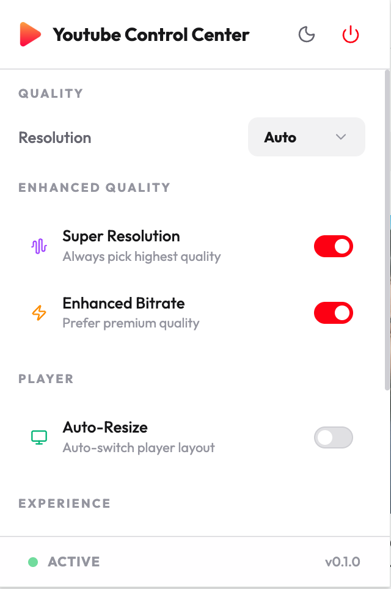
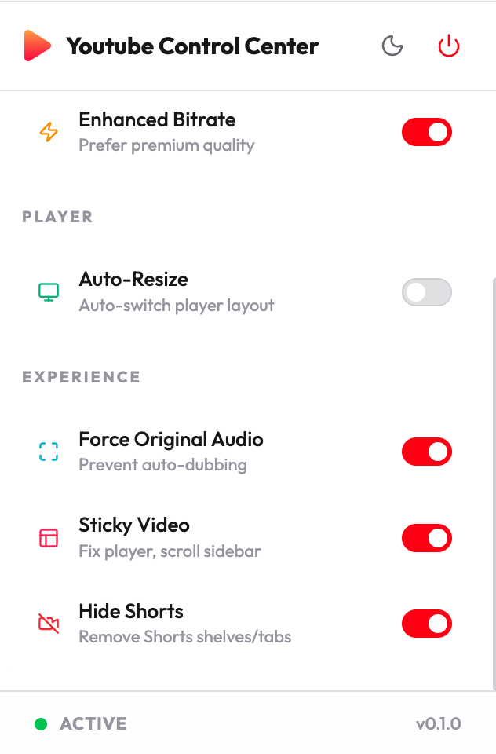

<p align="center">
  
  
  
</p>

<p align="center">
  
</p>

<h1 align="center">Youtube Control Center</h1>

<p align="center">
  <b>The ultimate extension to enhance and control your YouTube experience.</b>
</p>

<p align="center">
  
  &nbsp;&nbsp;&nbsp;&nbsp;
  
</p>

---

## ✨ Features

- **🚀 Super Resolution & Quality Lock**: Never settle for low quality. Automatically lock videos to 4K, 8K, or your highest preferred resolution.
- **✨ Enhanced Bitrate**: Prioritize premium bitrate streams for the sharpest visual fidelity available.
- **🎥 Advanced Player Layouts**: Auto-switch between **Cinema Mode** and **Default** views based on your preference.
- **🔇 Force Original Audio**: Prevents YouTube from playing auto-dubbed versions of videos, ensuring you always hear the original track.
- **📌 Sticky Video Player**: Keeps the video player fixed at the top while you scroll through the sidebar video list.
- **🚫 Hide YouTube Shorts**: Declutter your feed by removing Shorts shelves, tabs, and distractions.
- **🌓 Premium UI**: A modern, sleek interface with full support for Light and Dark modes.

## 🛠 Tech Stack

- **Core**: [WXT](https://wxt.dev/) (Web Extension Framework)
- **Frontend**: [React 19](https://react.dev/)
- **Styling**: [TailwindCSS 4](https://tailwindcss.com/)
- **Icons**: [Lucide React](https://lucide.dev/)

## 🚀 Development & Build

### Prerequisites
- Node.js (Latest LTS recommended)
- npm

### Installation
```bash
npm install
```

### Development
```bash
# Start development server for Chrome
npm run dev

# Start development server for Firefox
npm run dev:firefox
```

### Build for Production
Build for all supported browsers (Chrome, Edge, Firefox):
```bash
npm run build:all
```

To create zip files for distribution:
```bash
npm run zip:all
```

## 📚 Documentation

For more information on contributing or understanding the project internals, please refer to:
- [Contributing Guide](CONTRIBUTING.md): Guidelines for submitting bugs and feature requests.
- [Project Structure](docs/structure.md): Breakdown of the codebase and file organization.
- [Permissions](docs/permissions.md): Detailed explanation of required browser permissions.
- [Web Store Description](docs/webstore-description.txt): Pre-written SEO-friendly descriptions for distribution.

## 📄 License

This project is licensed under the [MIT License](LICENSE).
